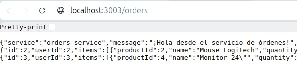
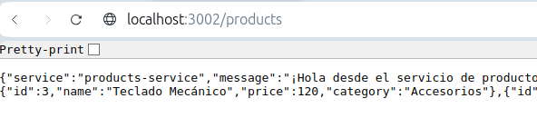
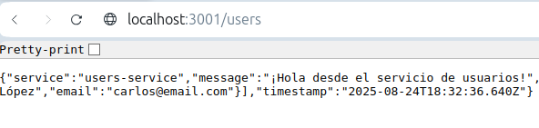
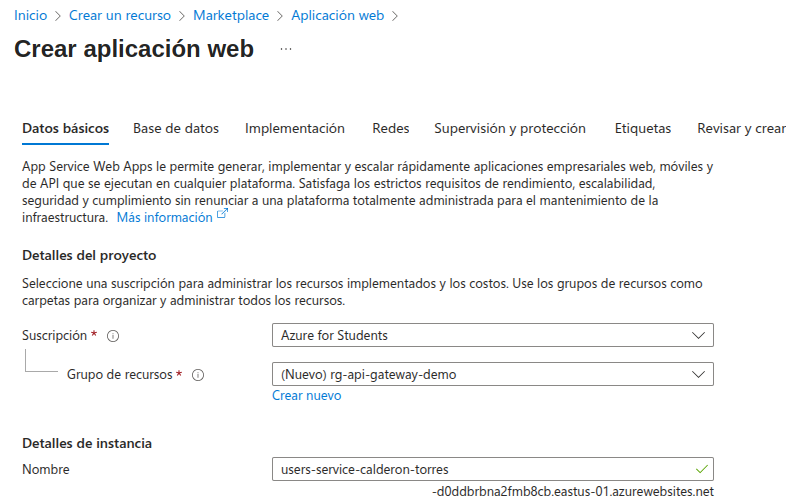
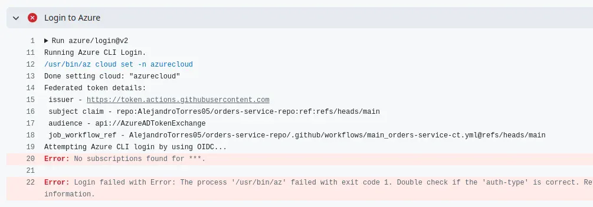
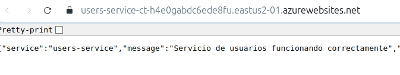
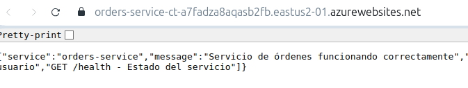
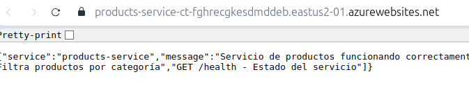
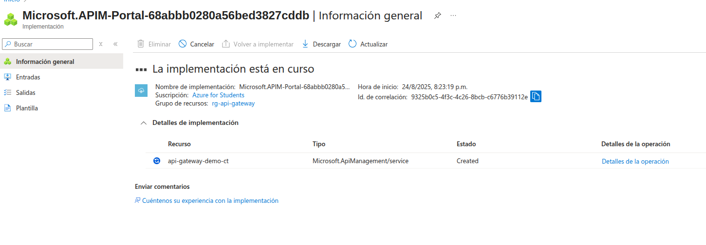

# Bitácora de Desarrollo (`dev-log.md`)

Este documento describe paso a paso el proceso de construcción del proyecto de arquitectura basada en API Gateway. La implementación se realizó con Node.js y busca ejemplificar el funcionamiento básico de este patrón arquitectónico en la nube.

---

### Creación de microservicios

Para poder usar un API Gateway y ejemplificarlo correctamente, es necesario definir microservicios para que el Gateway pueda hacer la redirección.

Para desarrollar este punto, decidimos generar el código de los microservicios con una inteligencia artificial. Puesto que, solo servirán de ejemplo y lo importante es el Gateway.

Hemos decidido generar microservicios de productos, órdenes y usuarios. Para cada uno dentro de su respectivo directorio corrimos los comandos:

```bash
npm init -y
npm install express
```

Y para correr cada microservicio

```bash
npm start
```

Todos los servicios corren en puertos diferentes (3001, 3002, 3003).







### Preparación de microservicios para subirlos a Azure

Primero, es necesario agregar en el package.json el engine. En nuestro caso, la configuración del engine para todos quedó así:

```javaScript
"engines": {
    "node": ">=22.0.0"
  }
```

A continuación, hay que ponerle a cada microservicio un [.gitignore]("../orders-service/.gitignore").

Luego, se configura un recurso de aplicación web en Azure para cada uno de los microservicios.



En la sección de plan, optamos por la opción de F1 que es gratuito. Pero, compartido. Se tomó está decisión para poder ahorrar créditos que pueden ser necesarios mas adelante en el curso.


Al momento de intentar desplegar los microservicios, nos encontramos con varios inconvenientes. La región de `est us` no nos daba un error, cambiamos a `us central`. Luego, en el despliegue esperamos poder subir los microservicios en un zip al portal de azure y como la opción no estaba habilitada fue necesario crear repositorios independientes para cada micro servicio y así poder hacer el despliegue.

[microservicio de usuarios]("https://github.com/AlejandroTorres05/users-service-repo") <br>
[microservicio de ordenes]("https://github.com/AlejandroTorres05/orders-service-repo")<br>
[microservicio de productos]("https://github.com/AlejandroTorres05/product-service-repo")

Al momento de hacer el despliegue, nos enfrentamos a un nuevo error



Realmente, no pudimos arreglar este error de forma directa. Tuvimos que borrar todo el el resource group y crear todo desde cero. En esta ocasión decidimos usar la región de `est us 2` y cambiamos el plan básico B1 que ya genera cobró, usando este plan, es necesario desactivar los servicios para que no generen cobros extra.

Teniendo esto presente, logramos subir correctamente los tres micro servicios correctamente.





Ahora, procedemos con la creación del Gateway. Dentro del conjunto de recursos de Azure, se llama API Management.
Un dato curioso es que tarda aproximadamente 15 minutos en crearse.


